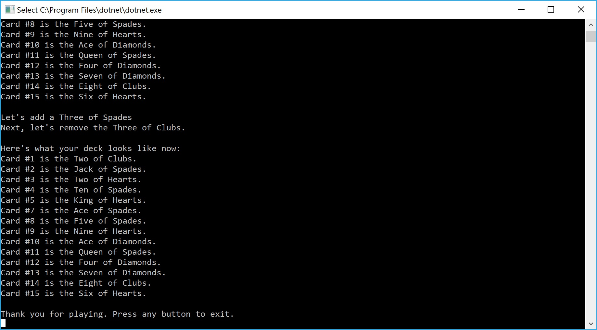

# Lab-07-Collections
 CODE: Collections for Code Fellows 401 C#/.NET course
 
**Author**: Earl Jay Caoile  
**Version**: 1.0.0

## Overview
This console app shows a use of collections with a deck of cards. Users will see an original list of cards and 

## Getting Started
The following is required to run the program.
1. Visual Studio 2017 
2. The .NET desktop development workload enabled
3. No External NuGet packages are required for this application. 

## Example

## Architecture
This application is created using ASP.NET Core 2.0 Console applicaitons.  
*Language*: C#  
*Type of Applicaiton*: Console Application  

## Change Log
06-14-2018 11:40 AM - initial scaffolding  
06-14-2018 2:00 PM - classes defined  
06-14-2018 5:00 PM - shuffle implemented  
06-14-2018 6:00 PM - add method implemented  
06-14-2018 7:00 PM - remove method implemented  
06-14-2018 8:00 PM - tests complete 
06-14-2018 10:00 PM - finished program 
06-14-2018 11:00 PM - finished readme 

